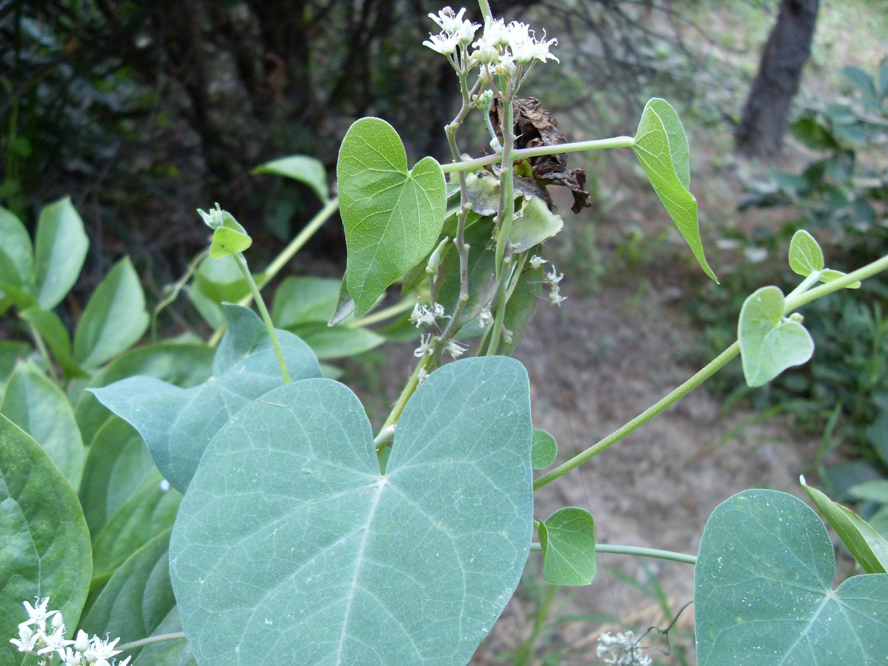

## 鹅绒藤

---

**拉丁名:**  _Cynanchum chinense R. Br_

**科 属:** 萝藦科 鹅绒藤属

**别 名:** 羊奶角角，牛皮消

**原产地:** 不详

**形  态:** 多年生缠绕草本，有乳汁，茎密生短柔毛。叶对生，宽三角状心形，先端狭突尖，基部心形，全缘；有长柄。聚伞花序腋生，花萼外面被柔毛；花冠白色，裂片5，两面无毛；副花冠杯状。蓇葖果，长角状。种子矩圆形，顶端有白绢质种毛。

**西大分布地:** 常见杂草，见于三校区各处。

**备注:** 2009年7月5日摄于西北大学北校区图书馆前。

 

 

