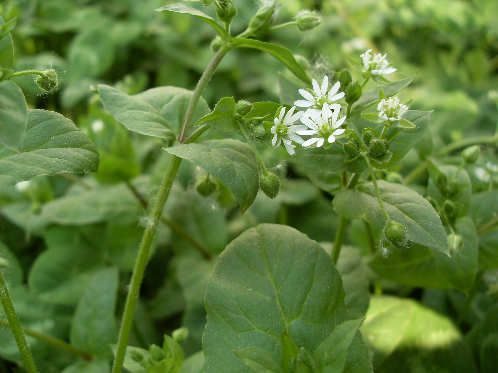

## 鹅肠菜

---

**拉丁名:**  _Myosoton aquaticum (Linn.) Moench _

**科 属:** 石竹科 鹅肠菜属

**别 名:** 脚皮菜、鸡肠菜
【形  态】一至二年生或多年生草本,全株光滑，仅花序上有白色短软毛
 。茎多分枝，柔弱，下部伏地生根，上部斜升，株高30～80厘米。叶对
 生，卵形或宽卵形，长2～5.5厘米，宽1～3厘米，顶端锐尖，基部心形，
 全缘而稍呈波状，上部叶无柄，基部略包茎，下部叶有柄。聚伞花序顶
 生。花梗细长，花瓣5，白色，顶端2深裂几达基部。蒴果卵形，5瓣裂，
 每瓣端再2裂。花期4～5月，果期5～6月。
【西大分布地】常见杂草，见于南北校区草丛及草坪中。
备注：
    2009年4月13日摄于西北大学北校区图书馆楼后西侧。

**原产地:** 鹅肠菜
详细资料： 首页 下一页 上一页
【拉丁名】Myosoton aquaticum (Linn.) Moench 
【科 属】石竹科 鹅肠菜属
【别 名】脚皮菜、鸡肠菜

**形  态:** 一至二年生或多年生草本,全株光滑，仅花序上有白色短软毛。茎多分枝，柔弱，下部伏地生根，上部斜升，株高30～80厘米。叶对生，卵形或宽卵形，长2～5.5厘米，宽1～3厘米，顶端锐尖，基部心形，全缘而稍呈波状，上部叶无柄，基部略包茎，下部叶有柄。聚伞花序顶生。花梗细长，花瓣5，白色，顶端2深裂几达基部。蒴果卵形，5瓣裂，每瓣端再2裂。花期4～5月，果期5～6月。

**西大分布地:** 常见杂草，见于南北校区草丛及草坪中。

**备注:** 2009年4月13日摄于西北大学北校区图书馆楼后西侧。

.JPG) 

 

