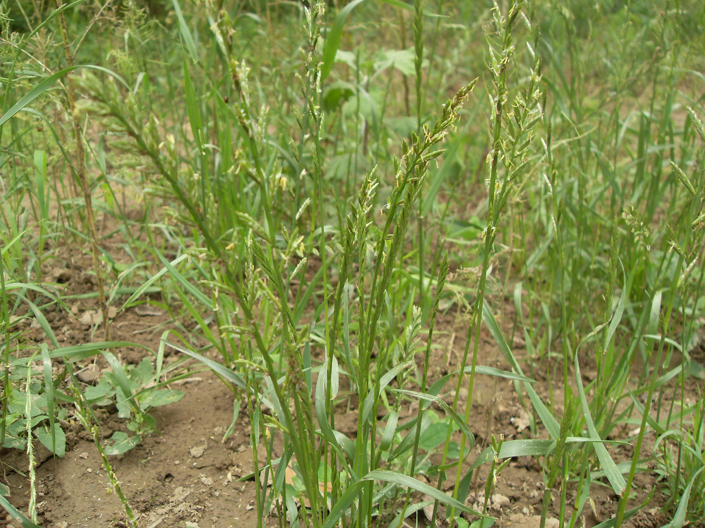

## 鹅观草

---

**拉丁名:**  _Roegneria kamoji Ohwi _

**科 属:** 禾本科 鹅观草属

**别 名:** 弯鹅观草、弯穗大麦草

**原产地:** 东亚

**形  态:** 多年生草本植物，秆丛生，高30～100厘米。叶鞘光滑，外侧边缘常有纤毛；叶片长5～35厘米，下垂。小时绿色或带紫色，长13～25毫米，含3～10小花；颖先端尖或有短芒，有3～5明显而粗状的脉及白色膜质边缘。内稃约与外稃等长，先端钝，脊有翼。颖果稍扁，黄褐色。花期4～5月。果期6～7月。

**西大分布地:** 常见杂草，见于三校区各处。

**备注:** 2009年5月17日摄于西北大学南校区待开发区。

.JPG) 

 

