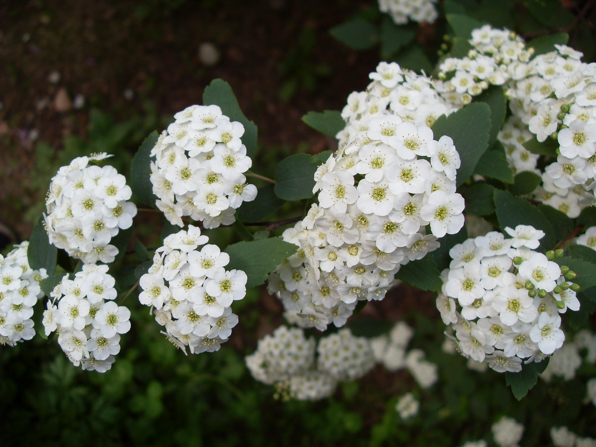
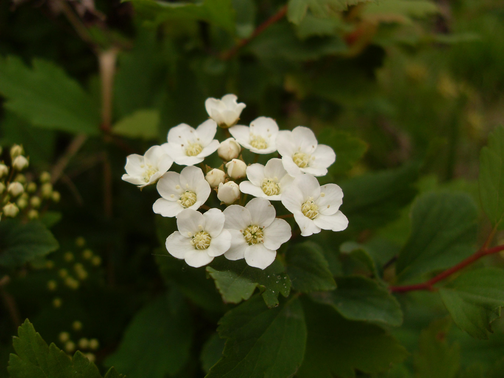

## 麻叶绣线菊

---

**拉丁名:**  _Spiraea cantoniensis Lour_

**科 属:** 蔷薇科 绣线菊属

**别 名:** 麻叶绣球、石棒子

**原产地:** 中国

**形  态:** 落叶乔木，高约1.5米；小枝细瘦呈拱形弯曲，幼时暗红褐色。叶菱状披针形或菱状长圆形，先端急尖，边缘在中部以上有缺刻状的锯齿，表面绿色，下面灰蓝色。伞形花序，花直径5～7毫米；花瓣5，白色，近圆形或倒卵形；花盘由大小不的近圆形裂片组成。蓇葖果直立开张。花期4～5月，果期7～9月。

**西大分布地:** 北校区见于行政楼前东侧及化工学院南侧花坛；南校区见于北门内西侧花坛内。

**备注:** 麻叶绣线菊详细资料：首页下一页上一页【拉丁名】SpiraeacantoniensisLour.【科属】蔷薇科绣线菊属【别名】麻叶绣球、石棒子【原产地】中国【形态】落叶乔木，高约1.5米；小枝细瘦呈拱形弯曲，幼时暗红褐色。叶菱状披针形或菱状长圆形，先端急尖，边缘在中部以上有缺刻状的锯齿，表面绿色，下面灰蓝色。伞形花序，花直径5～7毫米；花瓣5，白色，近圆形或倒卵形；花盘由大小不的近圆形裂片组成。蓇葖果直立开张。花期4～5月，果期7～9月。【西大分布地】北校区见于行政楼前东侧及化工学院南侧花坛；南校区见于北门内西侧花坛内。备注:2009年4月10日摄于西北大学北校区行政楼前东侧。

.JPG) 

 

 

