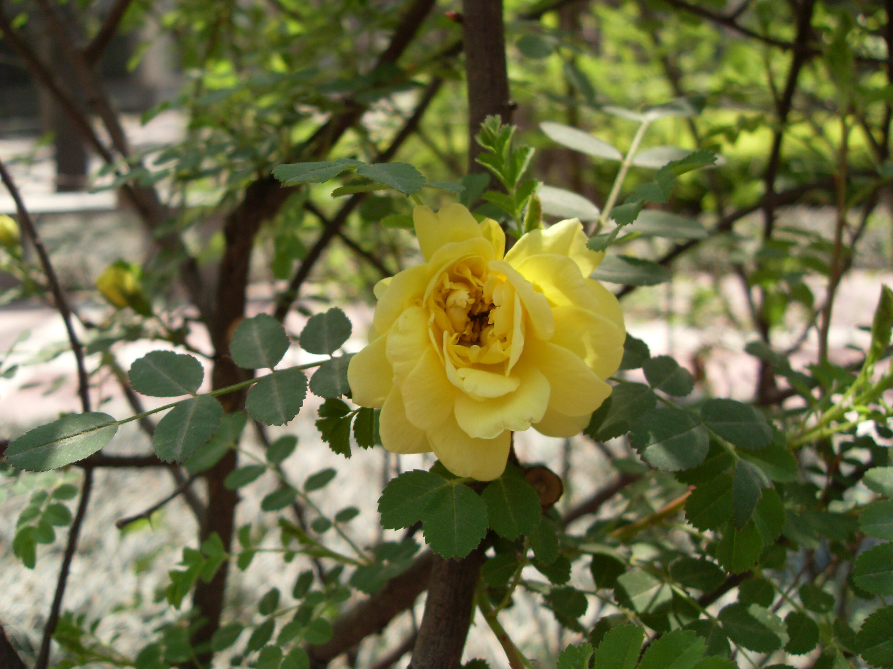

## 黄刺玫

---

**拉丁名:**  _Rosa xanthina Lindl_

**科 属:** 蔷薇科 蔷薇属

**别 名:** Rosa xanthina Lindl.
【科  属】蔷薇科  蔷薇属

**原产地:** 东亚

**形  态:** 落叶丛生灌木，高1～3米；小枝褐色，有硬直皮刺。无刺毛。小叶7～13，广卵形至近圆形，长0.8～1.5厘米，先端钝或微凹，缘有钝锯齿。花单生，黄色，单瓣或重瓣，径约4.5～5厘米。果近球形，红褐色，径约1厘米。花期4～5月。　　　　　　

**西大分布地:** 北校区见于化工学院南侧花坛内。 南校区见于南门外公路对侧绿化带上。 

**备注:** 上图为复瓣黄刺玫，2009年4月7日摄于西北大学北校区化工学院南侧花坛内。下图为单瓣黄刺玫，2009年4月12日摄于西北大学南校区南门外公路对侧绿化带。　

.JPG) 

 

 

