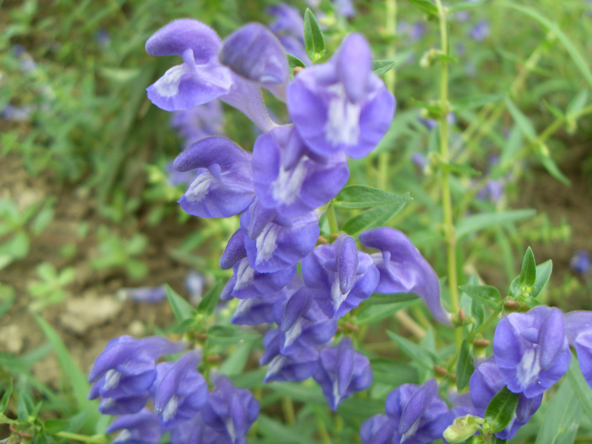

## 黄芩

---

**拉丁名:**  _Scutellaria baicalensis Georgi _

**科 属:** 唇形科 黄芩属

**别 名:** 烂心草、黄金茶
 【原产地】中国
 【形  态】多年生草本，高30～70厘米。主根粗壮，
  略呈圆锥形，棕褐色。茎四棱形，基部多分枝。单
  叶对生；具短柄；叶片披针形，全线。总状花序顶
  生，花偏生于花序一边；花唇形，蓝紫色。小坚果
  近球形，黑褐色，包围于宿萼中。花期7～10月，果
  期8～10月。
 【西大分布地】仅见于北校区西大花园内。
备注：
    2009年7月27日摄于西北大学北校区西大花园内。

**原产地:** 中国
【形 态】多年生草本，高30～70厘米。主根粗壮，
 略呈圆锥形，棕褐色。茎四棱形，基部多分枝。单
 叶对生；具短柄；叶片披针形，全线。总状花序顶
 生，花偏生于花序一边；花唇形，蓝紫色。小坚果
 近球形，黑褐色，包围于宿萼中。花期7～10月，果
 期8～10月。
【西大分布地】仅见于北校区西大花园内。
备注：
 2009年7月27日摄于西北大学北校区西大花园内。

**形  态:** 多年生草本，高30～70厘米。主根粗壮，略呈圆锥形，棕褐色。茎四棱形，基部多分枝。单叶对生；具短柄；叶片披针形，全线。总状花序顶生，花偏生于花序一边；花唇形，蓝紫色。小坚果近球形，黑褐色，包围于宿萼中。花期7～10月，果期8～10月。

**西大分布地:** 仅见于北校区西大花园内。

**备注:** 2009年7月27日摄于西北大学北校区西大花园内。

.JPG) 

 

