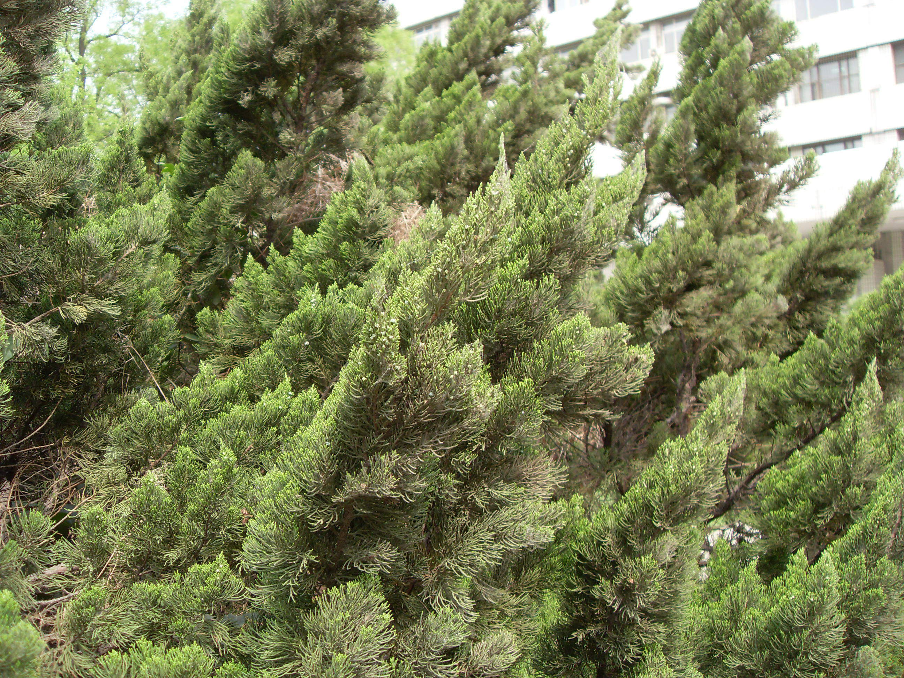

## 龙柏

---

**拉丁名:**  _Sabina Mill.cv.Kaizuca _

**科 属:** 柏科 圆柏属

**别 名:** 龙松、绕龙柏

**原产地:** 原种产中国，本种为园艺变种

**形  态:** 常绿乔木。树冠圆柱形或柱状塔形。分枝低，枝条向上直伸，常有扭曲上升之势，小枝稠密，在枝顶端成几等长之密簇，幼时淡黄绿色，后成翠绿色。叶多为鳞叶。雌雄异株。球果蓝色，微被白粉。花期4月，后一年11月果实成熟。　　　　

**西大分布地:** 北校区见于化工学院北门口及其前草坪；南校区散见于各处。

**备注:** 上图为龙柏株型，2009年4月17日摄于西北大学北校区化工学院北侧草坪。下图为龙柏雌球花，2009年4月17日摄于西北大学北校区化工学院北侧草坪。

.JPG) 

 

