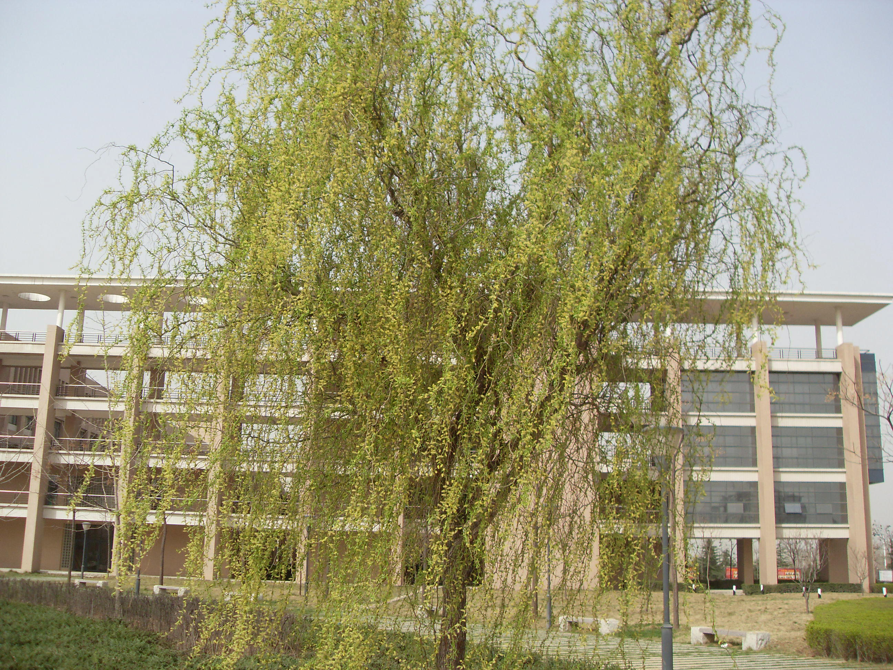
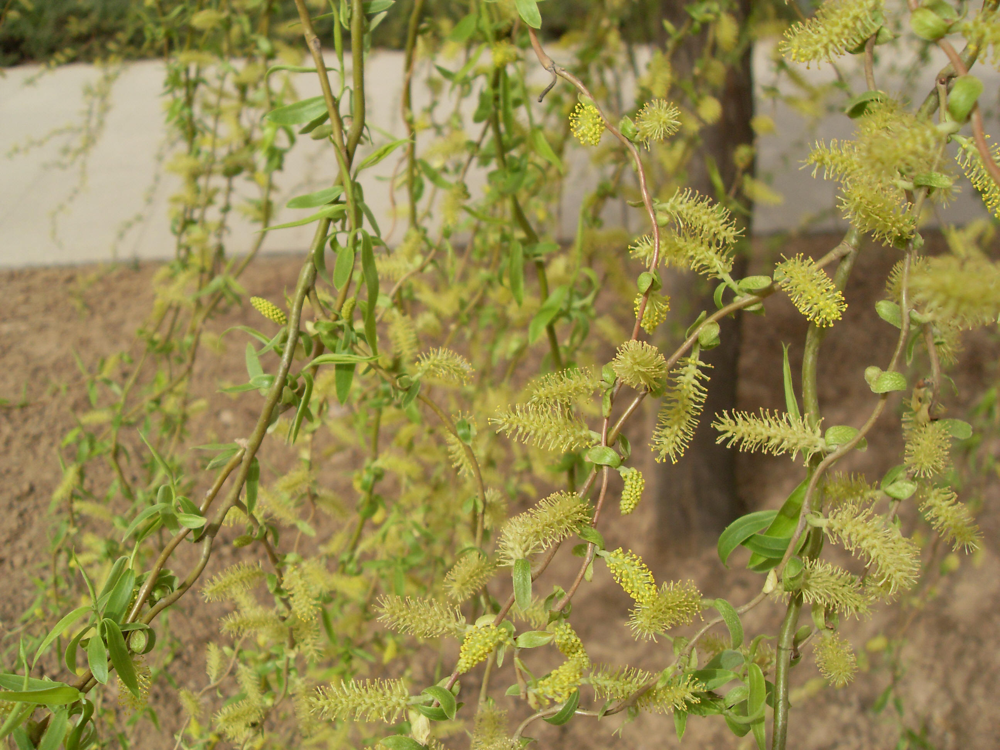

## 龙爪柳

---

**拉丁名:**  _Salix matsudana cv.tortuosa Vilm_

**科 属:** 杨柳科 柳属

**别 名:** 龙须柳
【形  态】杨柳科柳属旱柳变型，落叶灌木或乔木，株高6～9
 米。树冠长圆形树干、枝条曲折盘旋生长，扭曲如龙。叶披
 针形。柔荑花序，小花淡黄色，花期4～5月。其生长势较弱
 ，株体较小，易衰老，寿命短。
【西大分布地】仅见于南校区北门内喷泉广场左右。
备注：
    2009年3月22日摄于西北大学南校区北门内喷泉广场旁。
　
　
                                                                   
                                                                     上图为南校区所种龙爪柳单株树形
　
　
                                                                     左图为龙爪柳的柔荑花序
　
　

**原产地:** 龙爪柳
详细资料： 首页 下一页上一页 
【拉丁名】Salix matsudana cv.tortuosa Vilm.
【科 属】杨柳科 柳属
【别 名】龙须柳

**形  态:** 杨柳科柳属旱柳变型，落叶灌木或乔木，株高6～9米。树冠长圆形树干、枝条曲折盘旋生长，扭曲如龙。叶披针形。柔荑花序，小花淡黄色，花期4～5月。其生长势较弱，株体较小，易衰老，寿命短。

**西大分布地:** 仅见于南校区北门内喷泉广场左右。

**备注:** 2009年3月22日摄于西北大学南校区北门内喷泉广场旁。　　上图为南校区所种龙爪柳单株树形　　左图为龙爪柳的柔荑花序　　

 

 

