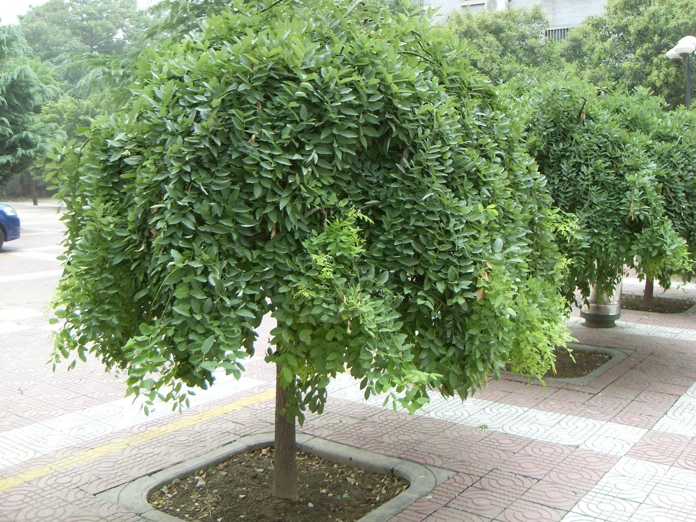

## 龙爪槐

---

**拉丁名:**  _Sophora japonica Linn. var. japonica f. pendula Hort _

**科 属:** 豆科 槐属

**别 名:** 垂槐、盘槐
 【形  态】落叶小乔木，为国槐一变种。小枝柔软下垂，树冠如伞，
  状态优美，枝条构成盘状，上部蟠曲如龙，老树奇特苍古。树势较
  弱，主侧枝差异性不明显，大枝弯曲扭转，小枝下垂，冠层可达
  50～70厘米厚，层内小枝易干枯。
 【西大分布地】北校区见于九号教学楼前、图书馆前及物理系后；
  南校区见于北门出。
备注：
   2009年7月28日摄于西北大学北校区九号教学楼前。
　

**原产地:** 龙爪槐
详细资料： 首页 下一页 上一页
【拉丁名】Sophora japonica Linn. var. japonica f. pendula Hort.
【科 属】豆科 槐属
【别 名】垂槐、盘槐
【形 态】落叶小乔木，为国槐一变种。小枝柔软下垂，树冠如伞，
 状态优美，枝条构成盘状，上部蟠曲如龙，老树奇特苍古。树势较
 弱，主侧枝差异性不明显，大枝弯曲扭转，小枝下垂，冠层可达
 50～70厘米厚，层内小枝易干枯。
【西大分布地】北校区见于九号教学楼前、图书馆前及物理系后；
 南校区见于北门出。
备注：
 2009年7月28日摄于西北大学北校区九号教学楼前。
　

**形  态:** 落叶小乔木，为国槐一变种。小枝柔软下垂，树冠如伞，状态优美，枝条构成盘状，上部蟠曲如龙，老树奇特苍古。树势较弱，主侧枝差异性不明显，大枝弯曲扭转，小枝下垂，冠层可达50～70厘米厚，层内小枝易干枯。

**西大分布地:** 北校区见于九号教学楼前、图书馆前及物理系后； 南校区见于北门出。

**备注:** 2009年7月28日摄于西北大学北校区九号教学楼前。　

 

