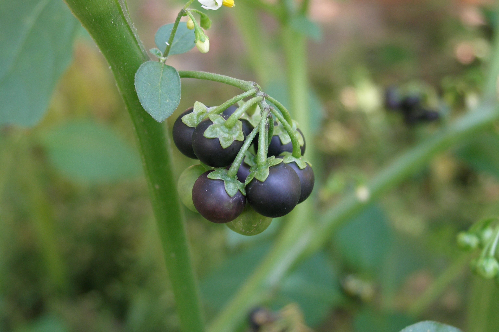

## 龙葵

---

**拉丁名:**  _Solanum nigrum Linn_

**科 属:** 茄科 茄属

**别 名:** 野葡萄、黑茄子 

**原产地:** 不详

**形  态:** 一年生草本，高30～100厘米。茎直立，多分枝。叶卵形，长2.5～10厘米，宽1.5～3厘米，顶端尖锐，全缘或有不规则波状粗齿，基部楔形，渐狭成柄；叶柄长达2厘米。花序为短蝎尾状或近伞状，侧生或腋外生，有花4～10，白色，细小；花序梗长1～2.5厘米，花柄长约1厘米；花萼杯状，绿色，5浅裂；花冠辐状。浆果球形，直径约8毫米，熟时黑色；种子近卵形，压扁状。花果期9—10月。

**西大分布地:** 三校区常见杂草，见于各处。

**备注:** 该图为李智选老师2008年9月4日摄于西北大学北校区。　

 

